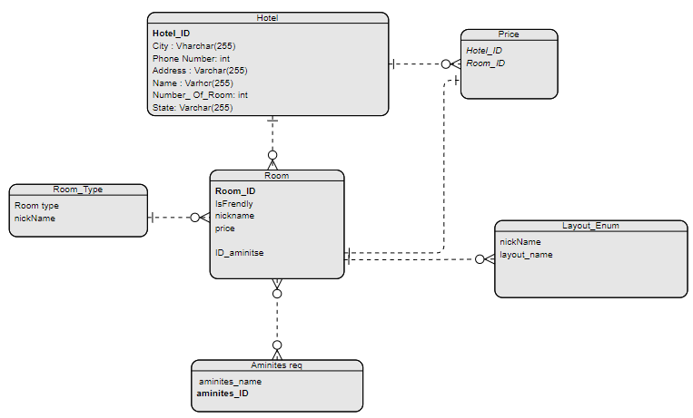

# AsyncInn

## Rama Maswadeh || 16/7/2023
## The ER Diagram for the ASYNC INN Hotel: 

## Exeplanation :
### The Hotel Table =>
+ It includes the Hotel_ID which is the **Primary Key** that means it's unique for each Hotel . It also has the city , phone number, Address , Name , Number of rooms and the state attributes, each one of them represent specific attribute for the Hotel and The Hotel entity has a **One to many** relation with the Room and the Price which means each Hotel can have multiple rooms with different prices.

### The Room Table => 
+ It includes the Room_ID as a primary key and it has **one to one** relation with the Price since each room has specific price depends on it's location, features (Aminities) and it's layout. it also has another **Many to Many** relationship with the aminities since the room can has more than one aminity and each aminity can be in several rooms , It has **Many to one** relationship with the type and the Layout enum , and finally it has one to one with the price .

### The Price Table => 
+ It has Hotel_ID and Room_ID both as foriegn key with 2 relations one with the Hotel and the other with the Room

### The aminities Table => 
+ It specify the features each room has like air conditioning, cofee maker , ocean view and others . It has ID and name and it connect with **Many to Many** relationship with the Room table.

### The Room_Type Table => 
+ It specify the room type , with one or 2 bedrooms or studio . It contains the nickname that depends on the type .

### The Layout Enum => 
+ It has the nickname of the room that depends on it . It contains several layouts of the rooms.

#
## Lab 13
### Architecture Pattern: Dependency Injection
+ Dependency Injection (DI) is a design pattern that allows the inversion of control in an application. Instead of creating dependencies within a class, the required objects or services are "injected" into the class from an external source. This external source is typically a container or framework responsible for managing the object creation and lifecycle. In the context of web applications, this pattern is particularly useful when working with controllers and services.